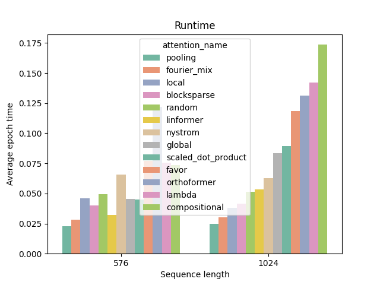

# xFormers
Flexible Transformers, defined by interoperable and optimized building blocks that you can trust.

(all of this is inspirational for now..)

# Key concepts
- **Field agnostic**. This repo is not focused on NLP, speech or vision, by design. The focus is on making sure that building transformers is a shared building block in between
- **Composable**. There are basically two obvious takes to the Transformer ecosystem:
  - support all the architectures proposed in different papers more or less individually
  - break all the achitectures into a block zoo, which allows you to recompose said reference models, but also study ablations, extensions easily, or field specific architectures (ie: sweep over the SOTA to see whether some technique is more applicable to a specific field).
    This repo aims at supporting this second way.

- **Extensible**. This is meant to support a research effort, and not to substitute to modelling and field specific know how, or to constraint into the use of specific blocks.
  xFormers aims at being easy to extend locally, so that one can focus on a specific improvement, and easily compare it against the state of the art.

- **Optimized**. This is largely aspirational for now, but reusing building blocks across teams and domains should mean that engineering efforts can be more valued, so that investing in speeding up some key building blocks (without breaking compatibility thanks to the settled interface) would make sense.

- **Tested**. Each and every of the variant in the repo should be tested, alone and composed with the other relevant blocks. This should happen automatically anytime somebody proposes a new variant through a PR

- **Crowd Sourced**. This is probably the single most important part. All of the above should make it possible for people interested to contribute: contributing on a small block is easier than on a full model, unit tests and common interfaces should help, the ability to extend the library locally and test the relevance prior to a PR should also help. PRs are really welcome.

# (Known) TODOs:
## CI
    [ ] Tests
        [x] Auto load new variants in tests
        [ ] Waay more tests, find more invariants depending on the blocks

    [ ] Benchmark:
        [x] add at least something basic to check training
        [x] measure throughput and memory
            [ ] autogenerate text report
            [x] autogenerate curves

## Architecture, code
    [x] Remove the AttrDict dependency
    [x] Handle encoder/decoder builds
    [ ] MHA: expose the projection, possibly make it swappable
    [ ] MHA: expose "max sequence size" intead of fixed size

## Repo features
    [ ] Decent "bibliography" section
    [ ] Decent full model presets (matching bibliography ideally)
    [ ] Autogenerate benchmark curves on github io or similar

## Variants, at least first ones to add

    [ ] Performer
    [x] Local attention
    [ ] Big Bird
    [x] Linformer
    [ ]...

## Adding new variants
Here are a couple of guidelines which should make it easier to add a new block variant to this repo:
* Blocks live in `xformers/components`
* Make sure that the block and its config inherit from the ones defined in the base file
* Default values need to be defined in the class constructor, not in the config.
  * Using the config objects is optional, people should feel free to cherry pick the blocks as is
  * Prevent duplication or colliding definitions
  * Make sure that the configurations are composable, in that a subset of the configs is enough to instantiate all the blocks with reasonable settings.
* Fields which have default values in the block constructor should be typed as `Optional[Type]`
* Please follow the CONTRIBUTING guide to make sure that formatting and linting is checked
* `@register` your new block variant with a unique and hopefully descriptive name
* Just define the (pure pytorch) constructor and forward call typically, no need to handle enything specific to this repo (except for inheritance)
* keep `*args` and `**kwargs` in your constructor, this is important for the config composition
* No need to change unit tests or benchmarks, the new variant will be automatically picked up

That's it. Rest assured that the community will be thankful for your contribution !

## Adding new models
Models live in `xformers/models`. As a general rule, one should try to write them using the blocks present in `xformers/components` (or upstream PyTorch), so that ulterior improvements are propagated to each implementation.

## Micro-Benchmark tools
These live in `xformers/benchmarks`. Sweeping over different attention settings to log max memory use and runtime can for instance be done by invoking
`python3 benchmarks/benchmark_encoder.py`. Specifying a subset to test is done through command line arguments, for instance `python3 benchmarks/benchmark_encoder.py --causal True --attentions random --activations gelu -fp16 True`.

Some examples:

## Bibliography
DRAFT, needs a proper citation format, ..

### Attention is all you need
    https://papers.nips.cc/paper/2017/file/3f5ee243547dee91fbd053c1c4a845aa-Paper.pdf

### Linformer
    https://arxiv.org/pdf/2006.04768.pdf

### BigBird
    https://github.com/google-research/bigbird
    https://papers.nips.cc/paper/2020/file/c8512d142a2d849725f31a9a7a361ab9-Paper.pdf

### Nystromformer
    https://arxiv.org/abs/2102.03902

### Performer
    https://arxiv.org/abs/2009.14794v1

### Reformer
    https://arxiv.org/abs/2001.04451

### Longformer
    https://github.com/lucidrains/local-attention
    https://arxiv.org/pdf/2004.05150.pdf

### Adaptive Attention Span
    https://www.aclweb.org/anthology/P19-1032.pdf
